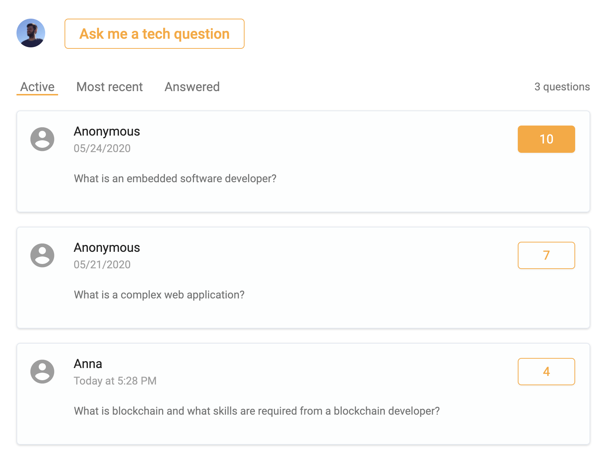

# Fully functional Questions and Answers board built with Gatsby and serverless Redis

<!-- This repo is a source code for my [article](https://dev.to/...) with a detailed explanation of how I used serverless Redis to create a Q&A board. -->

You can see this Q&A board in action [here](https://techforitrecruiters.com/questions)

#### I use Netlify both for deployment and development

- To use [netlify](https://www.netlify.com/) in development you need `npm install netlify-cli -g`
- Read the [docs](https://docs.netlify.com/) for more details.

#### The backend is built with Netlify [functions](https://www.netlify.com/products/functions/).

- Functions are in `/lambda` folder:

  - `question_create.js` POST create a question
  - `questions.js` GET - returns all approved questions
  - `questions_recent.js` GET - returns all approved questions sorted by date (DESC)
  - `questions_unswered.js` GET - returns all approved questions that have answers
  - `question_upvote.js` PATCH - upvote a question

  Admin endpoints:

  - `questions_unapproved.js` GET - returns all unapproved questions
  - `question_approve.js` PATCH - approve a question
  - `question_add_answer.js` PATCH - update a question with a url linking to an answer
  - `question_delete.js` DELETE - delete a question

#### Env variables

- You need to have env. variables set for development/deployment (for development, you need to keep the variables in `.env.development`):
  - REDIS_PORT=
  - REDIS_HOST=
  - REDIS_PASSWORD=
  - SENTRY_DSN={optional}

#### Redis

- I use Serverless Redis from [Upstash](https://upstash.com?utm_source=sndr_1)
